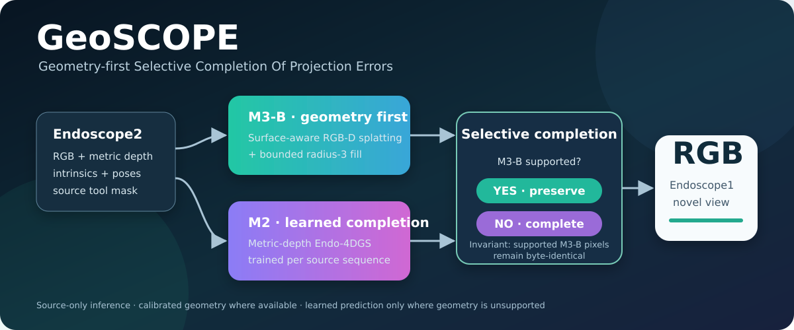
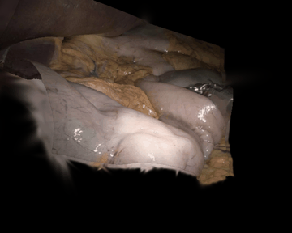
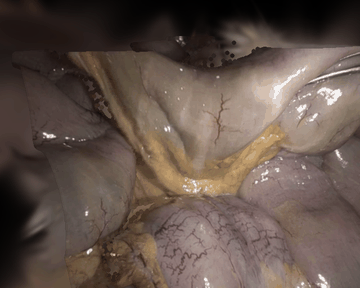
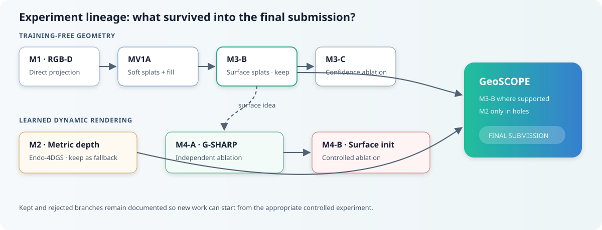

# GeoSCOPE

<p align="center">
  
</p>

<p align="center">
  <strong>Geometry-first Selective Completion Of Projection Errors for endoscopic novel-view synthesis</strong>
</p>

GeoSCOPE is our final submission to the **MICCAI 2026 iMED Novel View
Synthesis challenge**. It protects every prediction supported by calibrated
RGB-D geometry and invokes a learned dynamic renderer only for pixels that
remain unsupported:

```text
M3-B surface reprojection + radius-3 fill
                         │
                         ├── supported pixel → preserve M3-B exactly
                         └── unsupported pixel → use Method-2 Endo-4DGS
```

This strict rule is the central design: the learned fallback cannot modify a
single M3-B-valid pixel. On the fixed four-sequence development set, GeoSCOPE
improved frozen M3-B by **+0.504 dB PSNR** and **+0.0225 SSIM**, with zero
protected pixels changed.

> **Release status:** research/challenge code. Dataset access is controlled by
> the organizers and the full final method requires NVIDIA CUDA. Original
> project code is released under MIT; bundled third-party components retain
> their respective licenses.

## Reconstruction gallery

<p align="center">
  
  
</p>

The GIFs contain predictions only—no Endoscope1 ground truth. Their exact
frame ranges and generation settings are recorded in
[`assets/qualitative/README.md`](assets/qualitative/README.md). If they have
not yet been generated in your checkout, follow the one-command maintainer
step in that file.

## Results at a glance

Hidden-leaderboard values are historical challenge submissions; local values
use the documented development protocol and must not be ranked in the same
column.

| Method | Core idea | Hidden PSNR / SSIM | Status |
| --- | --- | ---: | --- |
| Endo-4DGS baseline | Dynamic Gaussian baseline | 18.760 / 0.623 | External reference |
| M1 | Direct RGB-D reprojection | 19.247 / 0.581 | Historical |
| MV1A | Depth-aware splats + bounded fill | 20.089 / 0.608 | Geometry reference |
| M2 | Endo-4DGS + metric depth | 18.722 / 0.617 | GeoSCOPE fallback |
| M3-B | Surface-aware RGB-D splats | 20.136 / 0.615 | GeoSCOPE geometry branch |
| M3-C | Confidence-gated surface splats | 20.130 / 0.614 | Ablation |
| M4-A / M4-B | Dynamic G-SHARP | 19.007 / 0.614; 19.040 / 0.614 | Ablations |
| **GeoSCOPE (M8-F1)** | M3-B + strict hole-only M2 | **20.412/0.626** | **Final submission** |

GeoSCOPE local ablation:

| Variant | Mean PSNR | Delta vs M3-B | Mean SSIM | Delta vs M3-B |
| --- | ---: | ---: | ---: | ---: |
| **F1 strict holes** | **19.6177** | **+0.5041** | **0.5262** | **+0.0225** |
| F2 exclude 1-pixel boundary | 19.5089 | +0.3953 | 0.5138 | +0.0101 |
| F2 exclude 2-pixel boundary | 19.4373 | +0.3238 | 0.5122 | +0.0085 |

See [the complete results and protocol notes](docs/RESULTS.md).

## Quick start: GeoSCOPE

### 1. Get the dataset

Register through the [official iMED Challenge website](https://imed-challenge.github.io/)
and request access from the [iMED Synapse project](https://www.synapse.org/Synapse%3Asyn74277461/wiki/640044).
The dataset is not redistributed here. Arrange each sequence as documented in
[`docs/DATA_AND_LEGALITY.md`](docs/DATA_AND_LEGALITY.md).

### 2. Build the final method

GeoSCOPE combines a lightweight PyTorch geometry path with compiled
Endo-4DGS CUDA extensions. Docker is the supported end-to-end environment:

```bash
cd methods/geoscope/code/docker_submission/method8_f1
bash scripts/build.sh geoscope:latest
```

The build uses the organizer Endo-4DGS image and the frozen MV1A runtime as
parents. Registry access may require Synapse authentication.

### 3. Render

```bash
docker run --rm --gpus all --network=none \
  -v /path/to/imed_nvs:/input:ro \
  -v /path/to/output:/output \
  geoscope:latest
```

Predictions are written to:

```text
/output/<sequence>/renders/00000.png
/output/<sequence>/renders/00001.png
...
```

Run the supplied smoke tests and one-sequence parity checks before using a
new build. Exact commands are in the [GeoSCOPE README](methods/geoscope/README.md).

## uv development environment

The root uv environment covers the training-free geometry methods, offline
analysis, and GIF tooling:

```bash
uv sync
source .venv/bin/activate
python -c "import torch; print(torch.__version__, torch.version.cuda)"
```

It intentionally does not build Endo-4DGS or G-SHARP CUDA extensions. Those
stacks have different compiler requirements; use the method-specific setup:

- [GeoSCOPE](methods/geoscope/README.md) — final Docker path and fusion tests
- [M1 RGB-D reprojection](methods/method1_rgbd_reprojection/README.md) — uv
- [MV1A](methods/method1_5_mv1a/README.md) — uv or lightweight Docker
- [M2 metric-depth Endo-4DGS](methods/method2_metric_depth/README.md) — Docker
- [M3 surface fusion](methods/method3_surface_fusion/README.md) — uv
- [M4 G-SHARP](methods/method4_gsharp/README.md) — separate uv + CUDA 12.6

See [Installation](docs/INSTALLATION.md) and the
[method development map](methods/README.md).

## Model availability

No pretrained checkpoints are distributed. M3-B is training-free, while the
Method-2 fallback optimizes a scene-specific model from the permitted
Endoscope2 observations at inference time. Consequently, there is no
universal checkpoint to download or apply across sequences. See
[`docs/MODEL_ZOO.md`](docs/MODEL_ZOO.md) for the exact model-availability
policy.

## Research journey

GeoSCOPE emerged from a controlled sequence of geometry and learned-rendering
experiments. These methods remain useful starting points for new work:

<p align="center">
  
</p>

| Family | Best use for development | Training |
| --- | --- | --- |
| M1 | Camera geometry, visibility, and renderer debugging | None |
| MV1A | Fast point-splat baseline | None |
| M2 | Dynamic Gaussian and metric-depth loss research | Per sequence |
| M3 | Surface footprints, normals, and confidence | None |
| M4 | Dynamic Gaussian surfel initialization studies | Per sequence |
| GeoSCOPE | Geometry/learned fallback and support-mask research | M2 branch only |

Each linked method README contains its environment, entry point, fixed
configuration, and reproduction order.

## Repository map

```text
├── methods/
│   ├── geoscope/                  # final submission
│   ├── method1_rgbd_reprojection/
│   ├── method1_5_mv1a/
│   ├── method2_metric_depth/
│   ├── method3_surface_fusion/
│   └── method4_gsharp/
├── experiments/                  # compact result records
├── docs/                         # data, setup, evaluation, reproducibility
├── assets/                       # architecture, lineage, prediction GIFs
├── scripts/                      # release and gallery tooling
├── pyproject.toml                # shared uv environment
└── CITATION.cff
```

## Evaluation and scientific boundary

Endoscope1 RGB is never used for training, calibration, transform selection,
confidence estimation, appearance correction, or inference. It is accessed
only by the offline evaluator after predictions are frozen. See
[Evaluation](docs/EVALUATION.md) and
[Data and legality](docs/DATA_AND_LEGALITY.md).

## Citation

If this repository helps your work, cite the software record for now:

```bibtex
@software{nct_tso_geoscope_2026,
  author  = {Danush Kumar Venkatesh & Stefanie Speidel},
  title   = {GeoSCOPE: Geometry-First Novel View Synthesis with Selective Learned Completion},
  year    = {2026},
  url     = {https://github.com/danushkv/iMED-nvs_challenge}
}
```

Please also cite the challenge:

```bibtex
@misc{imed_challenge_2026,
  author = {{iMED Challenge Organizers}},
  title  = {iMED Challenge 2026},
  year   = {2026},
  url    = {https://imed-challenge.github.io/}
}
```

The repository includes [`CITATION.cff`](CITATION.cff) for GitHub's “Cite this
repository” panel. Replace the software record with a paper citation if a
peer-reviewed GeoSCOPE publication becomes available.

## License and acknowledgements

Original code in this repository is available under the [MIT License](LICENSE).
Third-party and adapted components remain governed by their original terms;
see [`THIRD_PARTY.md`](THIRD_PARTY.md).

We gratefully thank the authors and maintainers of the open research projects
that made this work possible: **Endo-4DGS**, **3D Gaussian Splatting**,
**gsplat**, and **G-SHARP**. We also thank the iMED Challenge organizers for
providing the challenge, dataset access, evaluation protocol, and reference
baseline.

### Funding

This work is partly supported by the Federal Ministry of Research, Technology
and Space in DAAD project 57616814 (SECAI, School of Embedded Composite AI).
This work is funded by the German Research Foundation (DFG, Deutsche
Forschungsgemeinschaft) as part of the Reinhart Koselleck project — Project ID
560101272.
